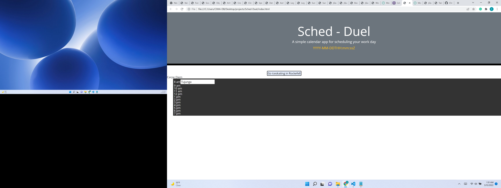

  # Title
  Sched-Duel
  
  ## Overview 
  >Time is a duel that we have to face, and making a battle plan for the day has been proven to work wonders.

  <!--GO AHEAD AND MANUALLY FIX THIS MARKDOWN FILE SO THE TABLE OF CONTENTS AND THE INSTALLATION NOTES LOOK LIKE A LIST.  I'M TRYING TO SOLVE PRINTING THE CHOICES ARRAY FROM THE INDEX.JS FILE AS AN OBJECT SO IT LOOKS MORE LIKE A LIST- IS IT A PARSE FUNCTION? FOUND https://www.w3schools.com/js/js_json_parse.asp OR IS IT A STRING  https://developer.mozilla.org/en-US/docs/Web/JavaScript/Reference/Global_Objects/Array/toString-->

  ## Contents
  * [Title](#title),
  * [Overview](#overview),
  * [Table of Contents](#contents),
  * [Description](#description),
  * [Installation](#installation),
  * [Notes](#notes),
  * [Usage](#usage),
  * [Credits](#credits),
  * [License](#license),
  * [Badges](#badges),
  * [Features](#features),
  * [Contribute](#contribute),
  * [Tests](#tests)

  ## Description
  <!--undefined hidden-->
  * Working remotelyprior to Covid, keeping a schedule was the norm, even from home.  However, during Covid, time has not been recorded as much, and we need to face Time again!
  * It was about Time! Seriously, work and life balance has been a topic of research and consternation. Procrastination affects one third of the population and I am personally in that category!
  * Simply writing down tasks and goals has been statistically proven to help you accomplish them.
  * In terms of coding, moment.js is fascinating and I hope to research how it works. It starts with one moment, then expands. 
  * Right now, the concept of the Duel is something that stands out, because it is often truly a battle.  There are no literal casualties, but indirectly many opportunities are lost when one ignores the challenge time presents us with everyday, to get up and duel your procrastinating self.

  ## Installation
  <!--* true-->
  undefined
  Moment.js needs to be installed, but may be accessed from the browser. 

  ## Usage
  * 
  * [GitHub Repo](https://github.com/ChristiLewis/Sched-Duel)
  <!--* false-->
  <!--* false-->
  
  ## Credits
  * [UM Coding Bootcamp](https://bootcamp.miami.edu/coding/)
  * [ChristiLewis](https://github.com/ChristiLewis)

  ## License
  * true
  
  ## Badges
  * ;

  ## Features
  * Javascript HTML generation

  ## Contribute
  * true

  ## Tests
  * JEST-TBD

  ## Contact
  * [Contact Me](clcxxxxxx.com)
